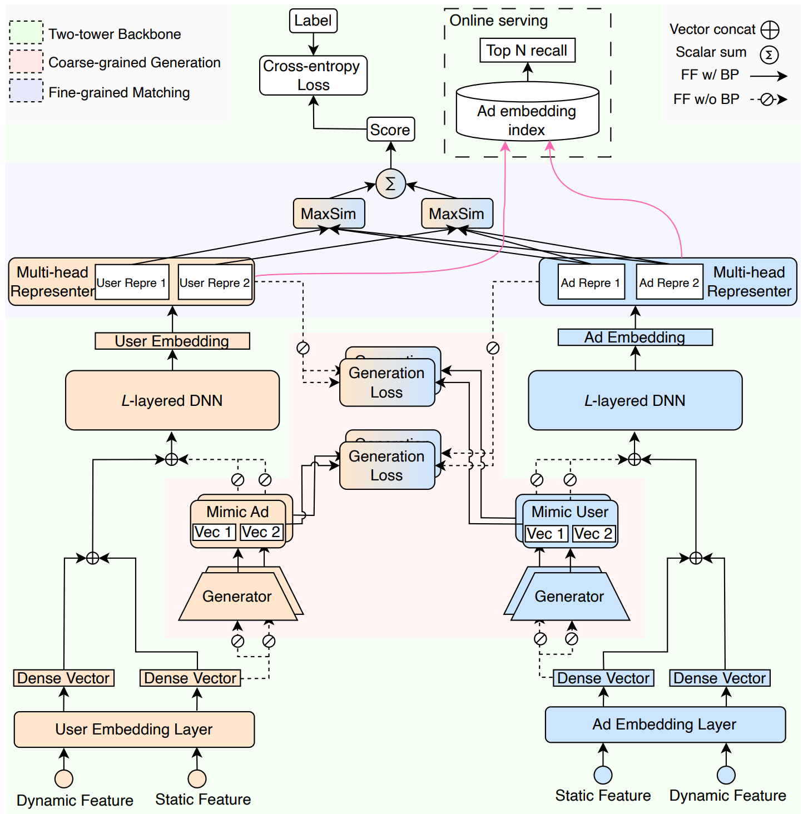
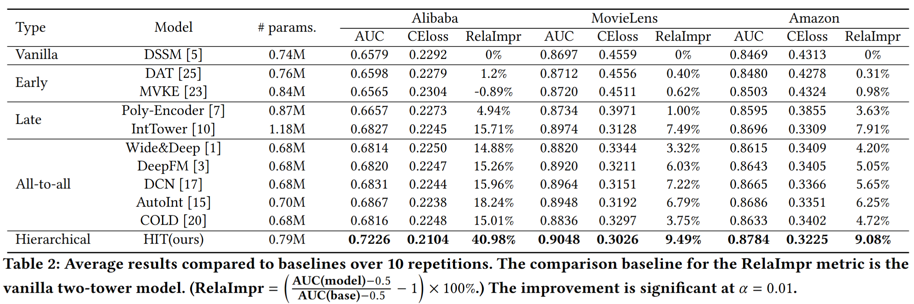

# Description
- Problem solved: We propose a Hybrid Interaction Two-Tower (HIT) model for the pre-ranking system. Without compromising computational efficiency, the extensive two-tower interaction significantly improves the calculation performance.
- Module details: In the two-tower model, we propose a hybrid interaction method that combines early-interaction and late-interaction, which are implemented through a generator and a Multi-Head Representer, respectively. The generator achieves early-interaction by generating high-dimensional embeddings for users or ads. The Multi-Head Representer implements late-interaction by mapping user or ad embeddings to multiple different dimensional heads, and calculating similarity between different heads.
- Results: We conducted a comprehensive evaluation on public and industrial datasets, and the results showed that the HIT model achieved the best performance in all cases. We also fully revealed the mechanism of hybrid interaction. In the online A/B test of the advertisement system, the HIT model increased the overall GMV by 1.6623%. After full implementation, it achieved significant economic benefits.
## Easy to use
``` shell
pip install -r requirements.txt
python train_amazon_whole_models.py --model_name tim
python train_taobao_whole_models.py --model_name tim 
python train_movielens_whole_models.py --model_name tim  
```
## Source code of Paper "IntTower: the Next Generation of  Two-Tower Model for Pre-ranking System" 

# Contents
- [Contents](#contents)
- [IntTower Description](#IntTower-description)
- [Dataset](#dataset)
- [Environment Requirements](#environment-requirements)
- [Quick Start](#quick-start)
- [Performance](#performance)


# [Dataset](#contents)

- [Movie-Lens-1M](https://grouplens.org/datasets/movielens/1m/)
- [Amazon(electronic)](https://jmcauley.ucsd.edu/data/amazon/)
- [Alibaba ads](https://tianchi.aliyun.com/dataset/dataDetail?dataId=56)

# [Environment Requirements](#contents)

- Hardware（CPU/GPU）
    - Prepare hardware environment with CPU or GPU processor.
- Framework
- Requirements
  - deepctr==0.9.0
  - deepctr_torch==0.2.7
  - deepmatch==0.2.0
  - keras==2.8.0
  - matplotlib==3.5.2
  - numpy==1.21.4
  - pandas==1.4.2
  - pytorch_lightning==1.6.3
  - scikit_learn==1.1.1
  - tensorflow==2.8.0
  - torch==1.10.0
  - torchkeras==3.0.2
  - torchsummary==1.5.1
  - torchvision==0.12.0
  - tqdm==4.51.0
  - xgboost==1.6.1
  
  
 # [Performance](#contents)
 

## cite our work
```
```

