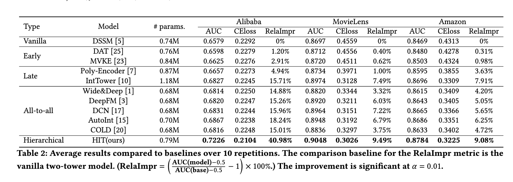

# Abstract
Pre-ranking systems in online display advertising play a critical role in efficiently filtering millions of candidate advertisements for each user within a very short time while maintaining high prediction accuracy. In the user-ad matching process, there are correlations between users(or ads) and target or non-target ads(or users), and all users and ads have multi-dimensional characteristics. However, existing models do not account for these factors, resulting in limited performance. As a result, existing models often struggle to effectively address two key challenges: establishing latent correlations between basic user/ad features and their high-level embeddings, and capturing the multi-faceted interests of users and the multi-dimensional attributes of ads.
To overcome these limitations, we propose the Hybrid Interaction-Enhanced Two-Tower (HIT) model, which introduces two novel components: a  \textbf{generator} and a \textbf{multi-head representer}. The generator bridges basic user/ad features from the early stages with subsequent high-level representations, fostering a more precise understanding of user preferences and ad attributes by constructing their connections.
The multi-head representer employs multiple linear projections to derive diverse representations of users’ multi-faceted interests and ads’ multi-dimensional attributes. Moreover, the HIT model retains the efficiency of the two-tower architecture, allowing for pre-computation of ad embeddings, thereby addressing inference efficiency and computational effectiveness. Extensive experiments on public datasets demonstrate that HIT achieves state-of-the-art performance, while large-scale online A/B tests show a 1.66\% increase in Gross Merchandise Volume and a 1.55\% improvement in Return on Investment, all without incurring excessive computational overhead. The HIT model is now deployed in a real-world advertising platform, impacting billions of daily user interactions.
## Easy to use
``` shell
pip install -r requirements.txt
python train_amazon_whole_models.py --model_name hit
python train_taobao_whole_models.py --model_name hit 
python train_movielens_whole_models.py --model_name hit  
```
## Source code of Paper "HIT Model: A Hybrid Interaction-Enhanced Two-Tower Model for Pre-Ranking System" 

# Contents
- [Contents](#contents)
- [Dataset](#dataset)
- [Environment Requirements](#environment-requirements)
- [Performance](#performance)


# [Dataset](#contents)

- [Movie-Lens-1M](https://grouplens.org/datasets/movielens/1m/)
- [Amazon(electronic)](https://jmcauley.ucsd.edu/data/amazon/)
- [Alibaba ads](https://tianchi.aliyun.com/dataset/dataDetail?dataId=56)

# [Environment Requirements](#contents)

- Hardware（CPU/GPU）
    - Prepare hardware environment with CPU or GPU processor.
- Framework
- Requirements
  - deepctr==0.9.0
  - deepctr_torch==0.2.7
  - deepmatch==0.2.0
  - keras==2.8.0
  - matplotlib==3.5.2
  - numpy==1.21.4
  - pandas==1.4.2
  - pytorch_lightning==1.6.3
  - scikit_learn==1.1.1
  - tensorflow==2.8.0
  - torch==1.10.0
  - torchkeras==3.0.2
  - torchsummary==1.5.1
  - torchvision==0.12.0
  - tqdm==4.51.0
  - xgboost==1.6.1
  
  
 # [Performance](#contents)
 
