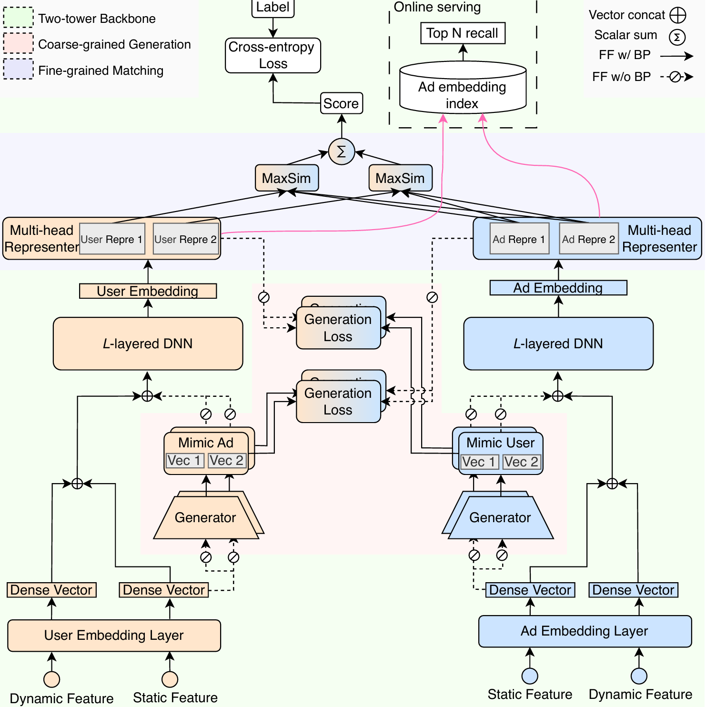

# Abstract
Online display advertising platforms rely on pre-ranking systems to efficiently filter and prioritize candidate ads from vast corpora, balancing relevance to users with strict computational constraints. The prevailing two-tower architecture, though highly efficient due to its decoupled design and pre-caching, suffers from cross-domain interaction and coarse similarity metrics, undermining its capacity to model complex user-ad relationships. In this study, we propose the Hierarchical Interaction-Enhanced Two-Tower (HIT) model, a new architecture that augments the two-tower paradigm with two key components: \textit{generators} that pre-generate holistic embeddings incorporating coarse-grained user-ad interactions via a dual-generator framework and cosine-similarity-based training objective, and \textit{multi-head representers} that project embeddings into multiple latent subspaces to capture fine-grained, multi-faceted user interests and multi-dimensional ad attributes. This design enhances modeling fidelity without compromising inference efficiency. Extensive experiments on public datasets and large-scale online A/B testing on Tencent's advertising platform demonstrate that HIT significantly outperforms several baselines in relevance metrics, yielding a 1.66\% increase in Gross Merchandise Volume and a 1.55\% improvement in Return on Investment, alongside similar serving latency to the vanilla two-tower models. The HIT model has been successfully deployed in Tencent's online display advertising system, serving billions of impressions daily.

## Easy to use
``` shell
pip install -r requirements.txt
python train_amazon_whole_models.py --model_name hit
python train_taobao_whole_models.py --model_name hit 
python train_movielens_whole_models.py --model_name hit  
```
## Source code of Paper "HIT Model: A Hierarchical Interaction-Enhanced Two-Tower Model for Pre-Ranking Systems" 

# Contents
- [Abstract](#abstract)
  - [Easy to use](#easy-to-use)
  - [Source code of Paper "HIT Model: A Hierarchical Interaction-Enhanced Two-Tower Model for Pre-Ranking Systems"](#source-code-of-paper-hit-model-a-hierarchical-interaction-enhanced-two-tower-model-for-pre-ranking-systems)
- [Contents](#contents)
- [Dataset](#dataset)
- [Environment Requirements](#environment-requirements)
- [Performance](#performance)


# [Dataset](#contents)

- [Movie-Lens-1M](https://grouplens.org/datasets/movielens/1m/)
- [Amazon(electronic)](https://jmcauley.ucsd.edu/data/amazon/)
- [Alibaba ads](https://tianchi.aliyun.com/dataset/dataDetail?dataId=56)

# [Environment Requirements](#contents)

- Hardware（CPU/GPU）
    - Prepare hardware environment with CPU or GPU processor.
- Framework
- Requirements
  - deepctr==0.9.0
  - deepctr_torch==0.2.7
  - deepmatch==0.2.0
  - keras==2.8.0
  - matplotlib==3.5.2
  - numpy==1.21.4
  - pandas==1.4.2
  - pytorch_lightning==1.6.3
  - scikit_learn==1.1.1
  - tensorflow==2.8.0
  - torch==1.10.0
  - torchkeras==3.0.2
  - torchsummary==1.5.1
  - torchvision==0.12.0
  - tqdm==4.51.0
  - xgboost==1.6.1
  
  
 # [Performance](#contents)
 
